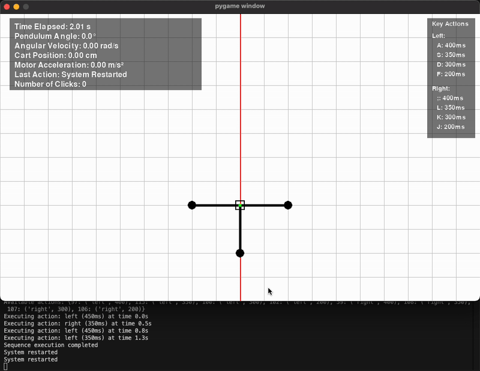

# 🌀 Single Pendulum Digital Twin

A digital twin simulation of a single rod pendulum built with Python and [pygame](https://www.pygame.org/).  
This project models and simulates pendulum dynamics and includes real-world dataset collection, automated movement, and filtering experiments.

---

## 📦 Install

```bash
pip install -r requirements.txt
```

---

## 🚀 Run the Simulation

```bash
python simulate_pendulum.py
```

This launches the pendulum simulation UI built with `pygame`.  
It visualizes the dynamics of a single rod pendulum and is synced with real-world data.

---

## 🤖 Automated Movements

We implemented scripts to automatically move the cart and swing the pendulum upward.



## 📂 Dataset Collection

We collected real-world sensor data across different scenarios to calibrate and validate the simulation.  
Here are sample recordings of the data collection sessions:

### 🎥 Cart Movements Dataset

Logs accelerometer + encoder data as the cart moves in short bursts.

[🎥 Single Pendulum Movements Video 1](https://hanzenl-my.sharepoint.com/:v:/r/personal/a_jafari_st_hanze_nl/Documents/pendulum_data_gathering/half.mp4?csf=1&web=1&nav=eyJyZWZlcnJhbEluZm8iOnsicmVmZXJyYWxBcHAiOiJPbmVEcml2ZUZvckJ1c2luZXNzIiwicmVmZXJyYWxBcHBQbGF0Zm9ybSI6IldlYiIsInJlZmVycmFsTW9kZSI6InZpZXciLCJyZWZlcnJhbFZpZXciOiJNeUZpbGVzTGlua0NvcHkifX0&e=sa3FTN)

[🎥 Single Pendulum Movements Video 2](https://hanzenl-my.sharepoint.com/:v:/r/personal/a_jafari_st_hanze_nl/Documents/pendulum_data_gathering/half.mp4?csf=1&web=1&nav=eyJyZWZlcnJhbEluZm8iOnsicmVmZXJyYWxBcHAiOiJPbmVEcml2ZUZvckJ1c2luZXNzIiwicmVmZXJyYWxBcHBQbGF0Zm9ybSI6IldlYiIsInJlZmVycmFsTW9kZSI6InZpZXciLCJyZWZlcnJhbFZpZXciOiJNeUZpbGVzTGlua0NvcHkifX0&e=sa3FTN)

---

### 🎥 Pendulum Extremes Dataset

Captures full-range theta swings — both minimum and maximum angles.

---

### 🎥 Single Pendulum Movements Dataset

Focuses on the pendulum's motion while the cart is stationary.

[🎥 Single Pendulum Movements Video](https://hanzenl-my.sharepoint.com/:v:/r/personal/a_jafari_st_hanze_nl/Documents/pendulum_data_gathering/pendulum_with_cart_movement.mp4?csf=1&web=1&nav=eyJyZWZlcnJhbEluZm8iOnsicmVmZXJyYWxBcHAiOiJPbmVEcml2ZUZvckJ1c2luZXNzIiwicmVmZXJyYWxBcHBQbGF0Zm9ybSI6IldlYiIsInJlZmVycmFsTW9kZSI6InZpZXciLCJyZWZlcnJhbFZpZXciOiJNeUZpbGVzTGlua0NvcHkifX0&e=z9IKFJ)

## 🛠️ Built With

- Python 3.x
- Pygame
- NumPy
- Pandas
- SciPy
